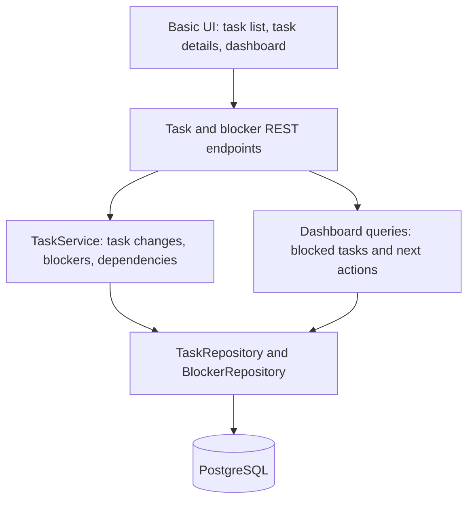
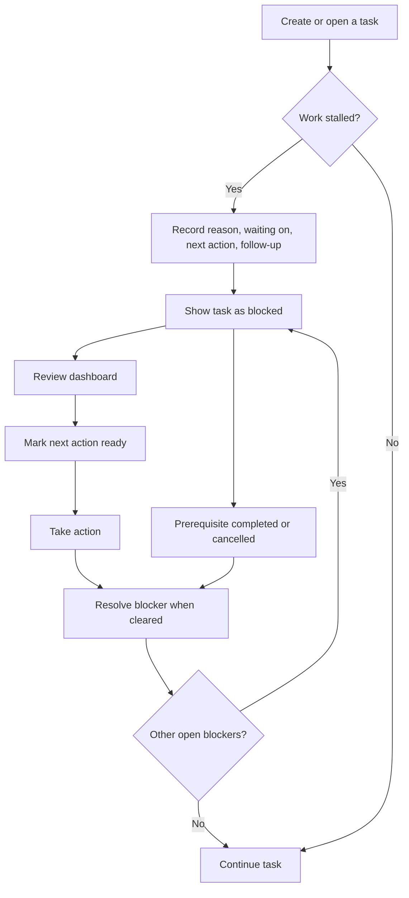

# Rizz - A Task Tracker

A task tracker that records why work is blocked, who or what it is waiting on, and what can happen next.

Work in progress. The scaffold currently supports creating and listing tasks. Blockers, the dashboard, and the architecture below are planned.

## Stack

- Java 21
- Spring Boot 4.1.1
- Spring Web MVC
- Spring Data JPA
- PostgreSQL

## Planned architecture



- Controllers handle HTTP requests and return response DTOs consistently.
- `TaskService` owns task changes, blocker changes, and dependency rules. Controllers access persistence through the service.
- Repositories store tasks and blockers. Dashboard queries calculate summaries from current records.
- No background jobs, notifications, or separate services. The frontend framework is still undecided.

### Tasks and Blockers

Task status stays `BACKLOG`, `IN_PROGRESS`, `COMPLETED`, or `CANCELLED`. A backlog or in-progress task is blocked when it has any unresolved blockers. Blocking does not replace task status.

A task can have multiple blockers. Each blocker records:

| Field | Purpose |
| --- | --- |
| Reason | What is blocking work: approval, missing information, procrastination, etc. |
| Waiting on | Optional person or thing, chosen from a small shared list of names |
| Next action | What can be done next |
| Action ready | Whether that action can be taken now, set manually |
| Follow-up time | Optional reminder time for the dashboard |
| Opened / resolved time | Whether the blocker is open and how long it has been blocked |
| Prerequisite task | Optional link to another task that must finish |

Shared waiting-on names keep counts such as "3 tasks waiting on Alex" consistent without requiring accounts.

Blockers can be added, edited, resolved, reopened, or deleted. Reopening starts a new blocked interval. Full blocker history is outside this version.

### Planned endpoints

| Path | Responsibility |
| --- | --- |
| `/api/tasks` | List and create tasks, as in the scaffold |
| `/api/tasks/{taskId}` | View, edit, and delete a task |
| `/api/tasks/{taskId}/blockers` | List and add blockers |
| `/api/tasks/{taskId}/blockers/{blockerId}` | Edit, resolve, reopen, or delete a blocker |
| `/api/dashboard` | Read blocked tasks, waiting-on counts, ready actions, and due follow-ups |

## Planned Blocker Flow



- Reject self-dependencies and dependency cycles.
- Completing or cancelling a prerequisite automatically resolves its dependency blockers. Deleting a prerequisite removes its dependency links. These changes do not complete dependent tasks.
- Reopening a prerequisite does not automatically reopen resolved blockers.
- Open blockers warn but do not prevent task completion. Completed and cancelled tasks stay out of dashboard action lists.

### Dashboard

| Section | Behavior |
| --- | --- |
| Blocked tasks | Show elapsed time since the oldest currently open blocker, such as "Blocked for 6 days" |
| Waiting on | Count distinct active tasks per person or thing, such as "3 tasks waiting on Alex" |
| Ready next actions | Show manually marked actions on open blockers; an available action may not clear every blocker on a task |
| Follow-ups due | Show follow-ups due now or overdue, separately from ready actions |

### Behavior to Verify During Implementation

- Resolving one of several blockers leaves the task blocked; resolving the last clears it.
- Waiting-on counts include each active task once per name, even with multiple matching blockers.
- Follow-ups appear when due. Readiness stays independent of follow-up time.
- Completing, cancelling, deleting, and reopening prerequisites follow the dependency rules above.
- Self-dependencies and cycles are rejected. Completed and cancelled tasks are excluded from dashboard action lists.

## Planned MVP Features

- [ ] Complete task CRUD
- [ ] Task status management (backlog, in progress, completed, cancelled)
- [ ] Task priority: low, medium, high
- [ ] Due dates and overdue tasks
- [ ] Blockers and task dependencies
- [ ] Dashboard for blocked tasks, waiting-on counts, ready actions, and follow-ups
- [ ] Basic web UI

## Planned post-MVP features

- [ ] User accounts, authentication, and user-specific tasks.
- [ ] Collaboration: task assignment and comments.
- [ ] Subtasks.
- [ ] More complete UI.

## Getting started

```bash
./mvnw spring-boot:run
```

App runs at [http://localhost:8080](http://localhost:8080).
